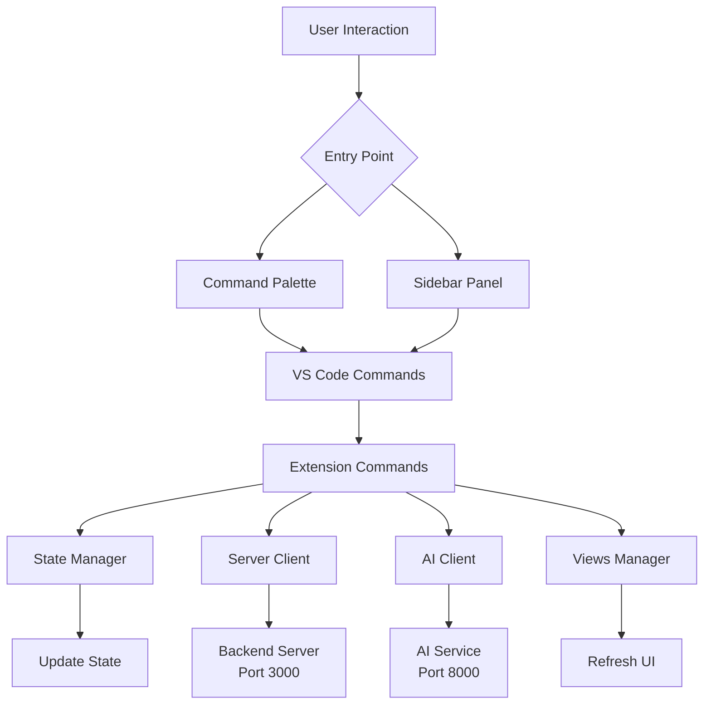

# 🔄 Manta Command Flow Documentation

## Overview
This document explains how commands flow through the Manta VS Code extension, from user interaction to backend processing.

---

## 🏗️ Architecture Overview



---

## 📋 Command Registration Flow

### 1. Extension Activation (`extension.ts`)

```
activate() is called by VS Code
    ↓
Initialize State (ExtensionState)
    ↓
Initialize Clients (ServerClient, AIClient)
    ↓
Register Sidebar Panel (SidebarProvider)
    ↓
Initialize Views Manager (ViewsManager)
    ↓
Register ALL Commands (commands.ts)
    ↓
Setup Event Listeners
    ↓
Connect to Services (Background)
```

**Key Points:**
- Commands are registered **immediately** on activation
- Service connections happen in the **background** (non-blocking)
- Sidebar loads **first** for instant UI feedback

---

## 🎯 Available Commands

### **Project Actions**

#### 1. `manta.startProject`
**Flow:**
```
User triggers command
    ↓
Show input box for project name
    ↓
Generate invite token (ServerClient)
    ↓
Update state with new project
    ↓
Show success message
    ↓
Refresh Flow Map & Duty Queue
```

**Files Involved:**
- [`commands.ts:18-41`](file:///c:/Users/victor/Desktop/kraken/manta/extension/src/commands.ts#L18-L41)
- `serverClient.ts` - Token generation
- `state.ts` - Project storage
- `views.ts` - UI refresh

---

#### 2. `manta.joinSession`
**Flow:**
```
User triggers command
    ↓
Show input box for invite token
    ↓
Call serverClient.joinSession(token)
    ↓
Receive session data from backend
    ↓
Update state (project + user role)
    ↓
Show success message
    ↓
Refresh Flow Map & Duty Queue
```

**Files Involved:**
- [`commands.ts:46-62`](file:///c:/Users/victor/Desktop/kraken/manta/extension/src/commands.ts#L46-L62)
- `serverClient.ts` - WebSocket communication
- `state.ts` - Session storage

---

### **Task Management**

#### 3. `manta.delegateTask`
**Flow:**
```
User triggers command
    ↓
Show input box for task name
    ↓
Call aiClient.autoAssignTask(taskName, members)
    ↓
AI analyzes and suggests best team member
    ↓
Call serverClient.assignTask(task, member)
    ↓
Backend assigns task
    ↓
Show success message
    ↓
Refresh Duty Queue
```

**Files Involved:**
- [`commands.ts:67-81`](file:///c:/Users/victor/Desktop/kraken/manta/extension/src/commands.ts#L67-L81)
- `aiClient.ts` - AI-powered assignment
- `serverClient.ts` - Task persistence

**AI Integration:**
- Uses AI to determine optimal team member
- Based on workload, skills, and availability

---

#### 4. `manta.approveMerge`
**Flow:**
```
User triggers command
    ↓
Get pending approvals from state
    ↓
Show quick pick list of pending tasks
    ↓
User selects task to approve
    ↓
Call serverClient.approveTask(taskName)
    ↓
Backend marks task as approved
    ↓
Show success message
    ↓
Refresh Duty Queue & Flow Map
```

**Files Involved:**
- [`commands.ts:86-107`](file:///c:/Users/victor/Desktop/kraken/manta/extension/src/commands.ts#L86-L107)
- `state.ts` - Pending approvals tracking
- `serverClient.ts` - Approval persistence

---

### **Code Actions**

#### 5. `manta.commitLogic`
**Flow:**
```
User triggers command on active file
    ↓
Get active editor & file content
    ↓
Call aiClient.reviewCode(path, content, 'logic')
    ↓
AI analyzes code for logic issues
    ↓
If suggestions exist:
    → Apply AI suggestions to state
    → Show notification to user
    ↓
Call serverClient.commitFile(path, content, 'logic')
    ↓
Backend saves commit
    ↓
Show success message
```

**Files Involved:**
- [`commands.ts:112-132`](file:///c:/Users/victor/Desktop/kraken/manta/extension/src/commands.ts#L112-L132)
- `aiClient.ts` - Code review
- `serverClient.ts` - Commit tracking

**AI Review:**
- Checks for security issues (e.g., `eval()`)
- Logic bugs and edge cases
- Performance issues

---

#### 6. `manta.commitStyles`
**Flow:**
```
User triggers command on active file
    ↓
Get active editor & file content
    ↓
Call aiClient.reviewCode(path, content, 'style')
    ↓
AI analyzes code for style issues
    ↓
If suggestions exist:
    → Apply AI suggestions to state
    → Show notification to user
    ↓
Call serverClient.commitFile(path, content, 'style')
    ↓
Backend saves commit
    ↓
Show success message
```

**Files Involved:**
- [`commands.ts:137-157`](file:///c:/Users/victor/Desktop/kraken/manta/extension/src/commands.ts#L137-L157)
- `aiClient.ts` - Style review
- `serverClient.ts` - Commit tracking

**AI Review:**
- Code formatting
- Naming conventions
- CSS/styling best practices

---

## 🔌 Service Integration

### Server Client (Backend)
**Port:** 3000  
**Protocol:** WebSocket  
**Responsibilities:**
- Project management
- Task assignment
- Real-time collaboration
- Commit tracking

**Methods Used:**
- `generateInviteToken()`
- `joinSession(token)`
- `assignTask(name, member)`
- `approveTask(name)`
- `commitFile(path, content, type)`

---

### AI Client
**Port:** 8000  
**Protocol:** HTTP (FastAPI/Uvicorn)  
**Responsibilities:**
- Task auto-assignment
- Code review (logic & style)
- AI suggestions

**Methods Used:**
- `autoAssignTask(taskName, members)`
- `reviewCode(path, content, type)`

---

## 🎨 UI Updates

### Views Manager
Manages all custom views:
- **Flow Map** - Project dependency graph
- **Duty Queue** - Task list in Explorer

**Refresh Methods:**
- `refreshFlowMap()` - Updates after project changes
- `refreshDutyQueue()` - Updates after task changes

---

## 🔄 Event Listeners

The extension listens to these VS Code events:

### 1. File Save (`onDidSaveTextDocument`)
```
File saved
    ↓
Get relative path
    ↓
Send serverClient.sendFileSaveEvent(path)
    ↓
Send aiClient.notifyFileSave(path, content)
```

### 2. File Close (`onDidCloseTextDocument`)
```
File closed
    ↓
Notify serverClient.notifyFileClose(fileName)
```

### 3. Active Editor Change (`onDidChangeActiveTextEditor`)
```
Editor changed
    ↓
Update state.setCurrentEditor(path)
```

### 4. Task Updates (WebSocket)
```
Server sends task update
    ↓
state.setTasks(tasks)
```

### 5. Dependency Updates (WebSocket)
```
Server sends dependency graph
    ↓
state.setDependencyGraph(graph)
```

### 6. AI Suggestions
```
AI sends suggestions
    ↓
state.applyAISuggestions(suggestions)
```

---

## 🚀 Execution Order on Startup

1. **Extension Activation** (`activate()`)
2. **State Initialization** (instant)
3. **Client Initialization** (instant, no connection yet)
4. **Sidebar Registration** (instant UI load)
5. **Views Manager** (initializes Flow Map & Duty Queue)
6. **Command Registration** (all 6 commands)
7. **Event Listener Setup**
8. **Background Service Connection** (100ms delay)
   - Connect to Backend Server (port 3000)
   - Connect to AI Service (port 8000)

> ⚠️ **Note:** Extension is fully functional even if services haven't connected yet. Connections happen in the background to avoid blocking the UI.

---

## 🧪 Testing Commands

### Via Command Palette
1. Press `Ctrl+Shift+P`
2. Type `Manta:`
3. Select command

### Via Sidebar
1. Click Manta icon in Activity Bar
2. Use buttons in Control Panel

---

## 📊 Command Summary Table

| Command | Trigger | Backend | AI | UI Update |
|---------|---------|---------|-----|-----------|
| `startProject` | User input | ✅ Token Gen | ❌ | Flow Map, Duty Queue |
| `joinSession` | User input | ✅ Join | ❌ | Flow Map, Duty Queue |
| `delegateTask` | User input | ✅ Assign | ✅ Auto-assign | Duty Queue |
| `approveMerge` | Quick pick | ✅ Approve | ❌ | Flow Map, Duty Queue |
| `commitLogic` | Active file | ✅ Commit | ✅ Review | None |
| `commitStyles` | Active file | ✅ Commit | ✅ Review | None |

---

## 🐛 Debugging

### View Command Execution
1. View → Output
2. Select "Manta" from dropdown
3. See logs for each command execution

### Check Service Status
- **Backend:** http://localhost:3000/api/health
- **AI:** http://localhost:8000/health

---

## 🔗 Related Files

- [`extension.ts`](file:///c:/Users/victor/Desktop/kraken/manta/extension/src/extension.ts) - Main activation logic
- [`commands.ts`](file:///c:/Users/victor/Desktop/kraken/manta/extension/src/commands.ts) - Command implementations
- [`serverClient.ts`](file:///c:/Users/victor/Desktop/kraken/manta/extension/src/serverClient.ts) - Backend communication
- [`aiClient.ts`](file:///c:/Users/victor/Desktop/kraken/manta/extension/src/aiClient.ts) - AI service communication
- [`state.ts`](file:///c:/Users/victor/Desktop/kraken/manta/extension/src/state.ts) - State management
- [`views.ts`](file:///c:/Users/victor/Desktop/kraken/manta/extension/src/views.ts) - UI management
- [`package.json`](file:///c:/Users/victor/Desktop/kraken/manta/extension/package.json) - Command declarations
