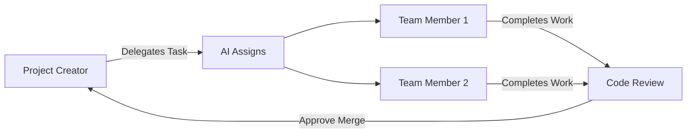

# 👥 How to Invite Members to Your Manta Project

## 🎯 Quick Summary

1. **Create a project** → Get an invite token
2. **Copy the token** → Click the "📋 Copy" button
3. **Share it** → Send to team members
4. **They join** → Using "Join Session"

---

## 📝 Detailed Step-by-Step Guide

### **For Project Creators (You)**

#### Step 1: Create Your Project

1. Open the **Manta sidebar** (click the Manta icon in the activity bar)
2. Click **"🚀 Start New Project"** button
3. Form expands - enter your project name (e.g., "WebApp Redesign")
4. Click **"Create Project"**

#### Step 2: Get Your Invite Token

After creating the project, you'll see a **project card** at the top of the sidebar:

```
┌─────────────────────────────────┐
│ 📁 WebApp Redesign              │
│ Token: abc123xyz456             │
│                     📋 Copy      │
└─────────────────────────────────┘
```

#### Step 3: Copy the Token

- Click the **"📋 Copy"** button next to the token
- The button will turn green and show **"✓ Copied!"** for 2 seconds
- Token is now in your clipboard!

#### Step 4: Share with Your Team

Send the token via any communication channel:
- **Slack**: Paste in your team channel
- **Discord**: Share in your server
- **Email**: Include in invitation email
- **Teams/Zoom**: Share during meetings
- **Any messenger**: WhatsApp, Telegram, etc.

**Example message:**
```
Hey team! Join our Manta project:
Project: WebApp Redesign
Token: abc123xyz456

1. Install Manta extension in VS Code
2. Click Manta icon (⚡) in sidebar
3. Click "Join Session"
4. Paste the token above
```

---

### **For Team Members (Joining)**

#### Step 1: Install Manta Extension

1. Open **VS Code**
2. Go to **Extensions** (Ctrl+Shift+X)
3. Search for **"Manta"**
4. Click **Install**

#### Step 2: Open Manta Sidebar

- Click the **Manta icon** (⚡) in the left activity bar
- Sidebar opens showing "Manta Control Panel"

#### Step 3: Join the Session

1. Click **"👥 Join Session"** button
2. Form expands with an input field
3. Paste the invite token you received
4. Click **"Join"** button

#### Step 4: Start Collaborating!

- You're now part of the project
- See project name and stats in sidebar
- View tasks in "Duty Queue" (Explorer sidebar)
- Start working on assigned tasks

---

## 🔐 Security Notes

### **Invite Token Best Practices**

✅ **DO:**
- Share tokens only with trusted team members
- Use private channels (DMs, private Slack channels)
- Revoke/change tokens if compromised (future feature)

❌ **DON'T:**
- Post tokens in public forums
- Share on public GitHub issues
- Include in public documentation

### **Token Format**

Tokens are generated as unique strings, for example:
- `proj_abc123def456`
- `manta_xyz789uvw012`

Each token is tied to a specific project.

---

## 📊 After Team Members Join

### **What the Creator Sees:**

The sidebar stats update automatically:

```
┌─────────────┬─────────────┐
│      5      │      3      │
│    Tasks    │   Members   │ ← Updates when people join
└─────────────┴─────────────┘
```

### **What Team Members See:**

Same project card:
```
┌─────────────────────────────────┐
│ 📁 WebApp Redesign              │
│ Token: abc123xyz456             │
│                     📋 Copy      │
└─────────────────────────────────┘
```

---

## 🎨 Visual Features

### **Copy Button States:**

1. **Default State:**
   - Blue background
   - Shows "📋 Copy"

2. **Hover State:**
   - Slightly darker blue
   - Scales up 5%

3. **Clicked State:**
   - Green background ✅
   - Shows "✓ Copied!"
   - Lasts 2 seconds
   - Auto-reverts to default

### **Clipboard Functionality:**

- Uses modern `navigator.clipboard` API
- Works in VS Code webview
- Fallback to alert if clipboard fails
- No manual selection needed

---

## 🔄 Collaboration Workflow

### **Once Everyone Has Joined:**



### **Typical Flow:**

1. **Creator delegates tasks** using "📋 Delegate Task"
2. **AI auto-assigns** to best available member
3. **Members see tasks** in their Duty Queue
4. **Members work** and commit changes
5. **Creator approves** merges via "✅ Approve Merge"

---

## 💡 Tips & Tricks

### **For Better Collaboration:**

1. **Name your project clearly**
   - ✅ "Mobile App Dashboard"
   - ❌ "Project123"

2. **Share context with the token**
   - Include project description
   - Link to repository
   - Mention tech stack

3. **Onboard new members**
   - Share HOW_TO_RUN.md
   - Explain the workflow
   - Do a quick demo call

4. **Use descriptive task names**
   - ✅ "Build login page with OAuth"
   - ❌ "Login stuff"

---

## 🐛 Troubleshooting

### **"Failed to join session"**

**Possible reasons:**
- ❌ Backend server not running
- ❌ Invalid/expired token
- ❌ Network connection issues

**Solutions:**
1. Check backend server is running (http://localhost:3000/api/health)
2. Ask project creator for a fresh token
3. Check your internet connection
4. Restart VS Code and try again

### **Copy button not working**

**Fallback:**
1. **Manual copy**: Select the token text with your mouse
2. Right-click → Copy
3. Or use Ctrl+C after selecting

### **Token not visible**

**Check:**
- Project was created successfully
- Sidebar has refreshed (reload if needed)
- You're looking at the correct sidebar (Manta, not Explorer)

---

## 📁 Related Documentation

- [**HOW_TO_RUN.md**](file:///c:/Users/victor/Desktop/kraken/manta/HOW_TO_RUN.md) - How to start all services
- [**SIDEBAR_UX.md**](file:///c:/Users/victor/Desktop/kraken/manta/docs/SIDEBAR_UX.md) - Sidebar features explained
- [**COMMAND_FLOW.md**](file:///c:/Users/victor/Desktop/kraken/manta/docs/COMMAND_FLOW.md) - How commands work

---

## 🎯 Key Takeaways

✅ **Inviting is easy**: Create project → Copy token → Share  
✅ **One-click copy**: No manual selection needed  
✅ **Visual feedback**: Button confirms successful copy  
✅ **Universal sharing**: Works with any communication tool  
✅ **Instant collaboration**: Members join and start working immediately  

---

## 🚀 Next Steps

After team members join:
1. **Delegate tasks** using AI-powered assignment
2. **Monitor progress** in Duty Queue
3. **Review code** with "Commit Logic" and "Commit Styles"
4. **Approve merges** when ready
5. **Ship together!** 🎉
