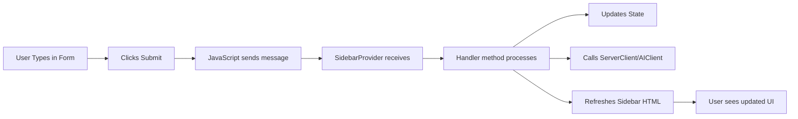

# 🎨 Enhanced Sidebar - Self-Contained UX

## ✨ What Changed

Previously, the sidebar buttons triggered VS Code commands that opened **external input boxes**. Now, **everything happens inside the sidebar** for a seamless, integrated experience!

---

## 🔄 Before vs After

### **Before (External Input Boxes)**
```
User clicks "Start New Project" button
    ↓
VS Code command palette opens (outside sidebar)
    ↓
User enters project name in popup
    ↓
Sidebar remains static
```

### **After (Internal Forms)** ✅
```
User clicks "Start New Project" button
    ↓
Form expands right in the sidebar
    ↓
User types in the sidebar input field
    ↓
Clicks "Create Project" button
    ↓
Sidebar refreshes with new project info
```

---

## 🎯 New Sidebar Features

### 1. **Expandable Forms**
Each action now has a **toggle button** that reveals a form:
- Click button → Form slides open
- Click again → Form closes
- Only one form open at a time (auto-closes others)

### 2. **In-Sidebar Input Fields**
- Clean, styled input boxes
- VS Code theme integration
- Auto-focus when opened
- Placeholder text for guidance

### 3. **Live Updates**
- Sidebar refreshes automatically after actions
- Project stats update in real-time
- Pending approval count badges

---

## 📋 Sidebar Actions

### **Project Actions**

#### 🚀 Start New Project
- **Toggle Button** → Opens form
- **Input Field**: Project name
- **Submit Button**: "Create Project"
- **Result**: Sidebar shows new project card with token

#### 👥 Join Session
- **Toggle Button** → Opens form
- **Input Field**: Invite token
- **Submit Button**: "Join"
- **Result**: Sidebar updates with joined project info

---

### **Task Management**

#### 📋 Delegate Task
- **Toggle Button** → Opens form
- **Input Field**: Task name
- **Submit Button**: "Delegate"
- **AI Magic**: Auto-assigns to best team member
- **Result**: Task added to Duty Queue

#### ✅ Approve Merge
- **Toggle Button** → Opens pending task list
- **Shows**: All tasks awaiting approval (badge count)
- **Click any task** → Instantly approves it
- **Result**: Task moves to approved state

---

### **Code Actions** (Unchanged)

These still work instantly without forms:

#### 💡 Commit Logic
- Click → Runs AI code review on active file
- No form needed (uses currently open file)

#### 🎨 Commit Styles
- Click → Runs AI style review on active file
- No form needed (uses currently open file)

---

## 🎨 Visual Design

### **Toggle Buttons**
- Secondary background color
- Arrow indicator (▼)
- Smooth hover effects
- Shows action name + icon

### **Input Forms**
- Clean panel with border
- VS Code theme colors
- Input fields with placeholders
- Highlighted submit buttons

### **Pending Tasks List**
- Scrollable if many items
- Hover effects (turns blue)
- One-click approval

---

## 💻 Technical Implementation

### **Message Flow**



### **Handler Methods**

Added 4 new methods in `SidebarProvider`:

1. **`handleStartProject(projectName)`**
   - Generates invite token
   - Updates state with new project
   - Refreshes sidebar UI

2. **`handleJoinSession(token)`**
   - Calls server to join session
   - Updates state with project + role
   - Refreshes sidebar UI

3. **`handleDelegateTask(taskName)`**
   - Uses AI to find best team member
   - Assigns task via server
   - Shows success notification
   - Refreshes sidebar UI

4. **`handleApproveMerge(taskName)`**
   - Approves task via server
   - Shows success notification
   - Refreshes sidebar UI

### **State Management**

The sidebar now:
- ✅ Fetches `pendingApprovals` from state
- ✅ Displays approval count in badge
- ✅ Refreshes after every action
- ✅ Maintains project info between actions

---

## 🚀 User Experience Improvements

### **Before**
- ❌ Disjointed UX (popup boxes)
- ❌ Context switching
- ❌ Sidebar stays static
- ❌ No visual feedback

### **After**
- ✅ Unified experience (everything in sidebar)
- ✅ Stay focused in one place
- ✅ Live UI updates
- ✅ Smooth animations and transitions
- ✅ Auto-focus on inputs
- ✅ Pending task counts visible

---

## 📸 Key Features

1. **Auto-Collapse Forms** - Only one form open at a time
2. **Auto-Focus Inputs** - Keyboard-friendly
3. **Real-time Updates** - Sidebar refreshes automatically
4. **Smart Badges** - Shows pending approval count
5. **Theme Integration** - Uses VS Code colors
6. **Smooth Transitions** - Polished animations

---

## 🧪 Testing the New Sidebar

1. **Reload Extension**
   - Press `F5` in Extension Development Host
   - Or reload the window

2. **Try Start Project**
   - Click "🚀 Start New Project"
   - Form expands with input field
   - Type a project name
   - Click "Create Project"
   - See project card appear above

3. **Try Delegate Task**
   - Click "📋 Delegate Task"
   - Enter task name
   - Click "Delegate"
   - AI assigns to team member
   - Notification appears

4. **Try Approve Merge** (if pending tasks exist)
   - Badge shows count: "✅ Approve Merge (3)"
   - Click to expand list
   - Click any task to approve
   - Task disappears from list

---

## 🎯 Benefits

### **For Users**
- Faster workflow
- Less context switching
- Everything at fingertips
- Visual feedback

### **For Developers**
- Cleaner code organization
- Better state management
- Easier to extend
- More maintainable

---

## 📁 Files Modified

- [`sidebarPanel.ts`](file:///c:/Users/victor/Desktop/kraken/manta/extension/src/sidebarPanel.ts)
  - Added 4 handler methods
  - Enhanced HTML with forms
  - Added toggle functionality
  - Improved styling

---

## 🔮 Future Enhancements

Potential additions:
- Form validation with error messages
- Loading states during AI processing
- Keyboard shortcuts (Enter to submit)
- Task editing directly in sidebar
- Drag-and-drop task reordering
- Member avatars and status indicators

---

## ✅ Summary

The sidebar is now **fully self-contained**:
- ✨ Beautiful, expandable forms
- 🎯 No external popups
- 🔄 Real-time updates
- 🎨 Polished UX
- ⚡ Fast and responsive

Everything happens **right where you need it** - in the sidebar!
